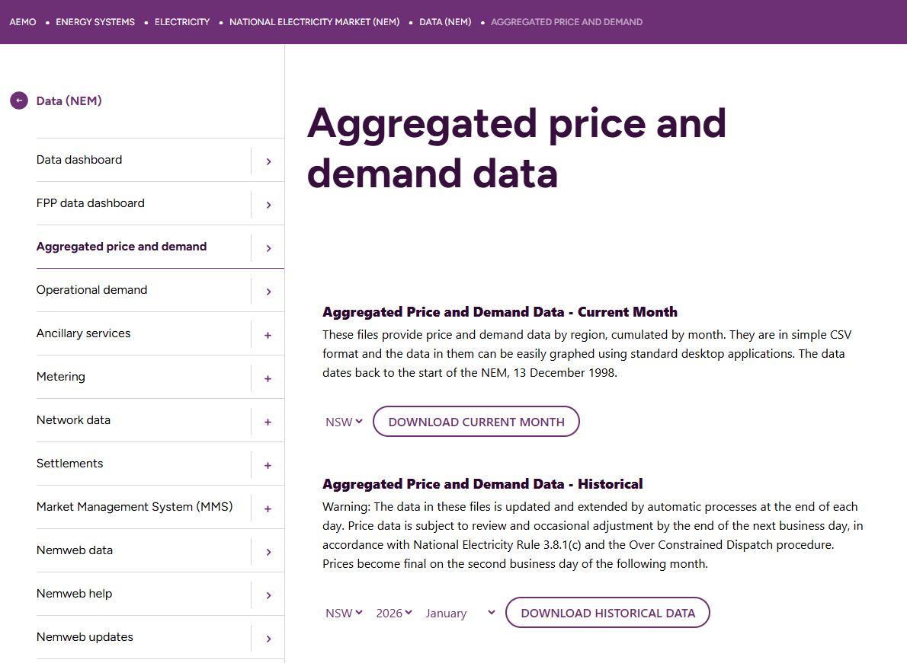
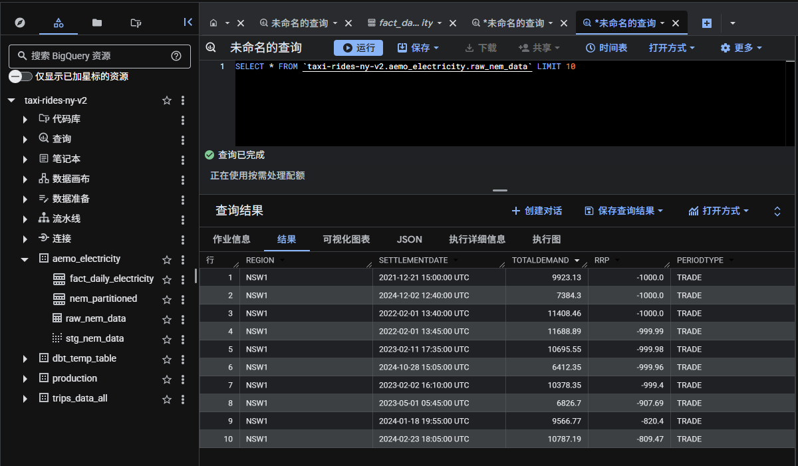

# Step 1: Dataset / 第一步：数据集

## Data Source / 数据来源

**AEMO (Australian Energy Market Operator) / 澳洲能源市场运营商**

- **Website / 官网:** https://aemo.com.au
- **Data page / 数据页面:** https://www.aemo.com.au/energy-systems/electricity/national-electricity-market-nem/data-nem/aggregated-data

## Why This Dataset / 为什么选这个数据集

- Real Australian government data, not simulated / 真实澳洲政府公开数据，非模拟数据
- URL follows a fixed pattern — ideal for automated downloading / URL有固定规律，适合自动化下载
- 300 files across 5 years × 5 states × 12 months / 5年×5州×12个月=300个文件
- Locally relevant for Australian job market / 对澳洲求职更有本地相关性

## URL Pattern / URL规律
```
https://aemo.com.au/aemo/data/nem/priceanddemand/PRICE_AND_DEMAND_{YYYYMM}_{REGION}.csv
```

Examples / 示例:
- NSW January 2023 / 新州2023年1月: `PRICE_AND_DEMAND_202301_NSW1.csv`
- VIC June 2024 / 维州2024年6月: `PRICE_AND_DEMAND_202406_VIC1.csv`

## Dataset Details / 数据集详情

| Property / 属性 | Value / 值 |
|----------------|-----------|
| States / 州 | NSW1, VIC1, QLD1, SA1, TAS1 |
| Period / 时间范围 | Jan 2020 – Dec 2024 |
| Files / 文件数 | 300 CSV files |
| Rows / 行数 | ~3 million (5-minute intervals / 每5分钟一条) |

## Columns / 数据列

| Column / 列名 | Type / 类型 | Description / 说明 |
|--------------|------------|-------------------|
| SETTLEMENTDATE | TIMESTAMP | Settlement time (every 5 min) / 结算时间（每5分钟） |
| REGION | STRING | State code / 州代码 |
| TOTALDEMAND | FLOAT | Total electricity demand (MW) / 总用电需求（兆瓦） |
| RRP | FLOAT | Regional reference price (AUD/MWh) / 地区参考价格（澳元/兆瓦时） |
| PERIODTYPE | STRING | Period type / 时段类型 |

## Screenshots / 截图

**AEMO Website / AEMO官网:**


**Raw Data Sample / 原始数据样本:**

