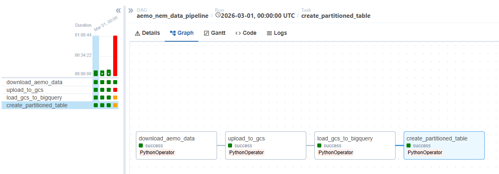
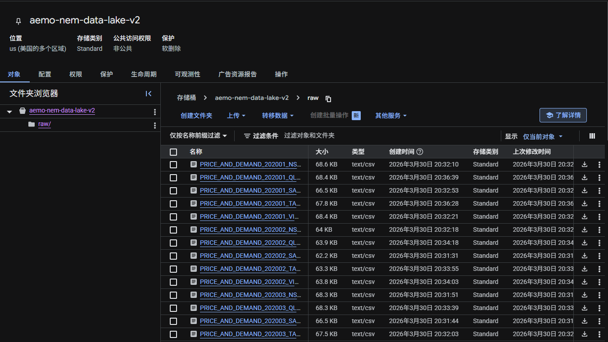

# Step 2: Data Lake / 第二步：数据湖

## Overview / 概述

This step uses Apache Airflow to orchestrate the downloading of 300 CSV files from AEMO and uploading them to Google Cloud Storage (GCS) as the data lake.

本步骤使用Apache Airflow编排，自动从AEMO下载300个CSV文件并上传到Google Cloud Storage（GCS）作为数据湖。

## Why GCS as Data Lake / 为什么用GCS作为数据湖

- Cheap object storage — ideal for raw file storage / 廉价对象存储，适合存原始文件
- Raw data is never deleted — can reload to BigQuery anytime / 原始数据永久保留，随时可重新加载
- Standard pattern in data engineering / 数据工程标准架构模式

## Airflow DAG / 编排流程

The DAG (`aemo_pipeline_dag.py`) runs 4 tasks in sequence:
DAG文件包含4个按顺序执行的任务：
```
download_aemo_data → upload_to_gcs → load_gcs_to_bigquery → create_partitioned_table
```

| Task / 任务 | Action / 动作 |
|------------|--------------|
| `download_aemo_data` | Download 300 CSVs from AEMO / 从AEMO下载300个CSV |
| `upload_to_gcs` | Upload to GCS bucket / 上传到GCS数据湖 |
| `load_gcs_to_bigquery` | Load into BigQuery raw table / 加载到BigQuery原始表 |
| `create_partitioned_table` | Create partitioned + clustered table / 创建分区聚簇优化表 |

## GCS Bucket / 数据湖存储

- **Bucket name / 桶名:** `aemo-nem-data-lake-v2`
- **File path pattern / 文件路径:** `raw/PRICE_AND_DEMAND_{YYYYMM}_{REGION}.csv`

## Screenshots / 截图

**Airflow DAG — All tasks successful / 所有任务成功:**


**GCS Bucket — Raw CSV files / 原始CSV文件:**

