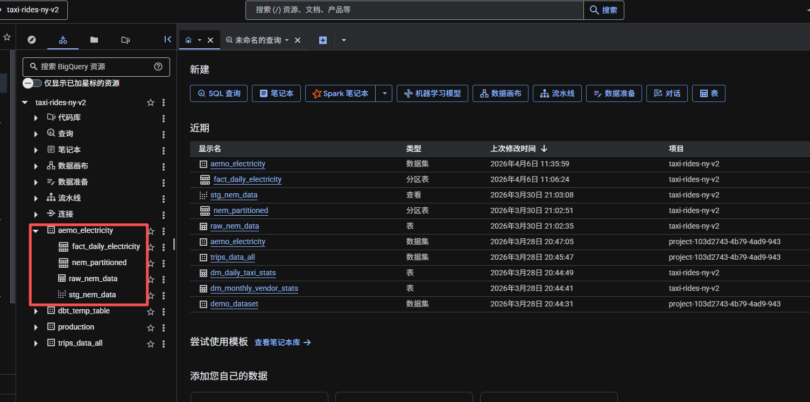
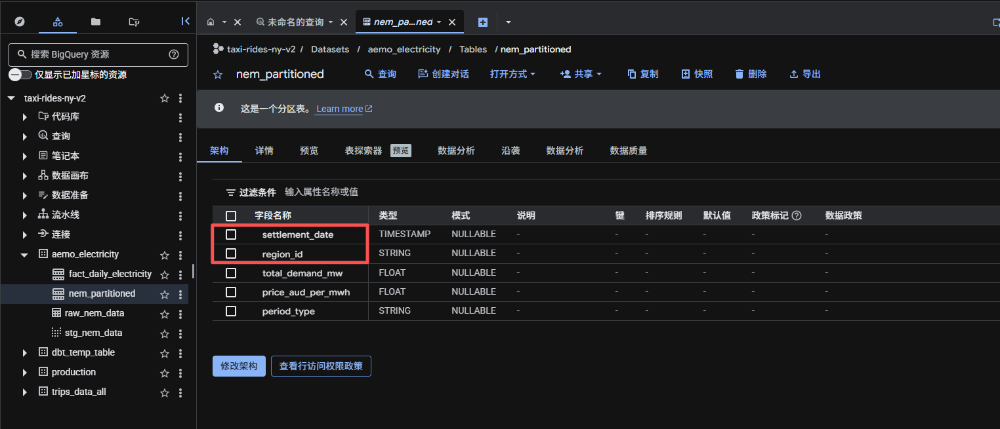
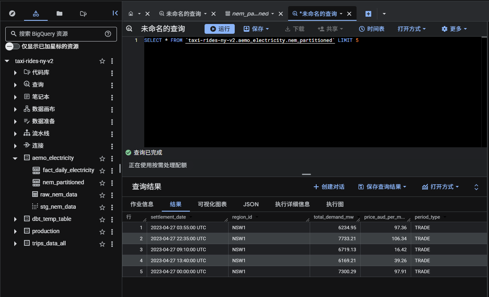

# Step 3: Data Warehouse / 第三步：数据仓库

## Overview / 概述

This step loads raw CSV data from GCS into BigQuery and creates an optimised table with partitioning and clustering for efficient analytical queries.

本步骤把GCS里的原始CSV数据加载到BigQuery，并创建带分区和聚簇的优化表，提升分析查询效率。

## BigQuery Tables / 数据表

| Table / 表名 | Type / 类型 | Description / 说明 |
|-------------|------------|-------------------|
| `raw_nem_data` | Table | Raw data loaded from GCS / 从GCS加载的原始数据 |
| `nem_partitioned` | Table | Partitioned + clustered optimised table / 分区+聚簇优化表 |

## Partitioning & Clustering / 分区与聚簇

**Why partition by date? / 为什么按日期分区？**
- 5 years × 5 states × 288 intervals/day = ~2.6 million rows
- Querying "2023 data" only scans 1/5 of the table
- BigQuery charges by data scanned — partitioning saves money
- 查询"2023年数据"只扫描1/5的数据，BigQuery按扫描量收费，分区省钱

**Why cluster by region_id? / 为什么按州聚簇？**
- Most queries filter by state (e.g. WHERE region_id = 'NSW1')
- Clustering stores same-state rows together physically
- Further reduces scan within each partition
- 大多数查询都会筛选特定州，聚簇让同州数据物理上存在一起，进一步减少扫描量

## Schema / 表结构

| Column / 列名 | Type / 类型 | Description / 说明 |
|--------------|------------|-------------------|
| settlement_date | TIMESTAMP | 5-minute interval timestamp / 每5分钟结算时间 |
| region_id | STRING | State code / 州代码 |
| total_demand_mw | FLOAT | Total demand in megawatts / 总需求（兆瓦） |
| price_aud_per_mwh | FLOAT | Price in AUD per MWh / 电价（澳元/兆瓦时） |
| period_type | STRING | Period type / 时段类型 |

## Screenshots / 截图

**BigQuery Dataset Overview / 数据集总览:**

**nem_partitioned Table Schema / 分区表结构:**

**Data Sample / 数据样本:**

