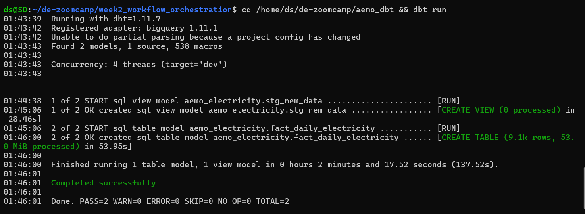
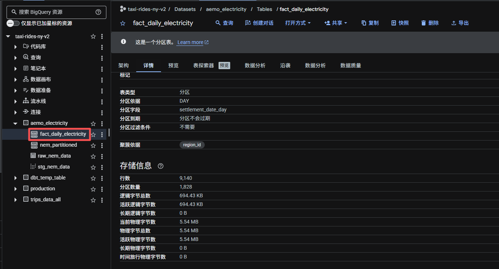

# Step 4: Transformations / 第四步：数据转换

## Overview / 概述

This step uses dbt (data build tool) to transform raw data in BigQuery into clean, aggregated tables ready for the dashboard.

本步骤使用dbt对BigQuery中的原始数据进行转换，生成干净的聚合表供dashboard使用。

## Why dbt? / 为什么用dbt？

- Write transformations as SQL files — version control friendly / 用SQL文件写转换逻辑，方便版本控制
- Automatically handles model dependencies / 自动处理模型间的依赖关系
- Generates data lineage documentation / 自动生成数据血缘文档
- Industry standard tool used in production / 业界标准工具，生产环境广泛使用

## Two-Layer Architecture / 两层架构
```
nem_partitioned (BigQuery source)
    ↓
stg_nem_data (Staging VIEW / 清洗层视图)
    ↓
fact_daily_electricity (Core TABLE / 每日汇总表)
```

## Models / 模型说明

### Staging Layer / 清洗层 (`stg_nem_data`)
- **Type / 类型:** VIEW (no data stored, always fresh / 不存数据，实时计算)
- **Purpose / 用途:** Clean column names, add derived fields / 清洗列名，添加派生字段
- **Added fields / 新增字段:** `year`, `month`, `hour`, `settlement_date_day`

### Core Layer / 汇总层 (`fact_daily_electricity`)
- **Type / 类型:** TABLE (pre-aggregated, fast queries / 预聚合，查询快)
- **Purpose / 用途:** Daily aggregates per state / 每州每日聚合
- **Result / 结果:** 9,140 rows from ~3 million raw rows / 从300万行聚合到9,140行
- **Also partitioned + clustered / 同样有分区+聚簇**

## How to Run / 如何运行
```bash
# Install dbt / 安装dbt
pip install dbt-bigquery

# Configure connection / 配置连接 (~/.dbt/profiles.yml)
dbt init aemo_dbt

# Run all models / 运行所有模型
cd aemo_dbt
dbt run

# Expected output / 预期输出:
# PASS=2 WARN=0 ERROR=0 TOTAL=2
```

## Screenshots / 截图

**dbt run — Success / 运行成功:**


**fact_daily_electricity — 9,140 rows / 9140行:**

