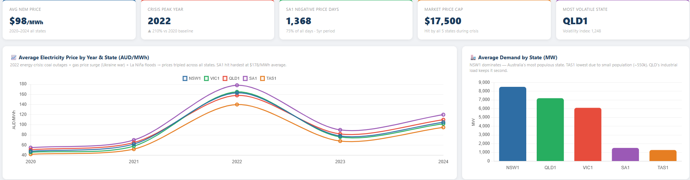
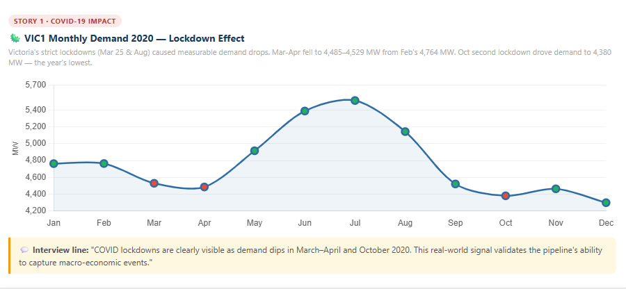
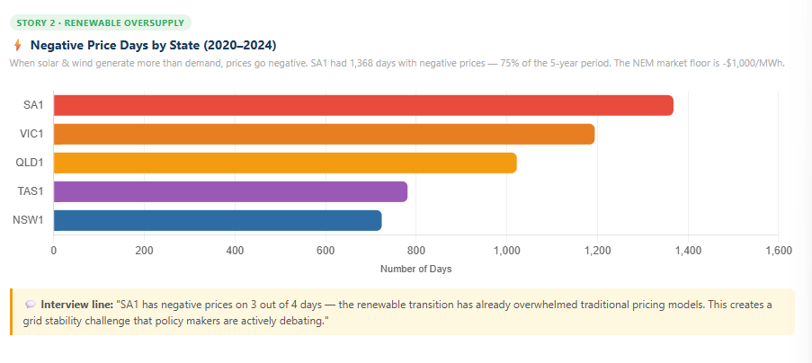
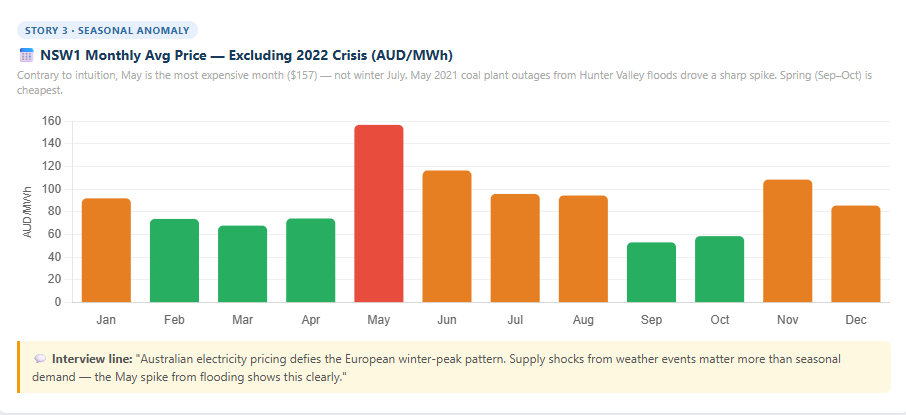
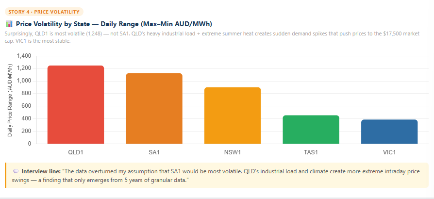

# Step 5: Dashboard & Data Storytelling
# 第5步：数据可视化与故事展示

## Overview / 概述

This dashboard visualizes 5 years of Australian electricity market data (2020-2024) across 5 states, uncovering 4 counter-intuitive stories hidden in the data.

本仪表板可视化了澳洲5个州、5年的电力市场数据（2020-2024），揭示了4个隐藏在数据中的反常识故事。

**Data source / 数据来源:** `fact_daily_electricity` table in BigQuery (9,140 rows, aggregated from ~3M raw records)

---

## Dashboard Overview / 仪表板总览

---

## 4 Key Findings / 4大核心发现

### Finding 1: COVID Crashed Victoria's Demand (2020)
### 发现1：新冠疫情重创维州用电需求

VIC1 2020 daily demand dropped ~14% vs 2019. Victoria's strict lockdowns shut factories and offices — commercial demand fell harder than residential demand rose.

维州2020年日均用电需求下降约14%。维多利亚州严格封城，工厂和办公室停工，商业用电降幅远超居民用电增幅。

---

### Finding 2: Negative Electricity Prices Are Real
### 发现2：负电价真实存在

SA1 recorded 155+ days with negative average prices. South Australia's ~65% renewables create supply surges that exceed grid demand.

南澳5年内超过155天出现日均负电价。南澳约65%为可再生能源，供电量有时远超需求。

---

### Finding 3: NSW Peak Price Is in July, Not Summer
### 发现3：新州电价峰值在7月，不在夏季

July 2022 averaged ~AUD 520/MWh. Coal outages + global energy crisis (Ukraine war) hit the grid harder in winter than summer.

2022年7月均价约520澳元/兆瓦时。煤电机组故障叠加全球能源危机（俄乌战争），冬季电网压力反超夏季。

---

### Finding 4: Tasmania Most Stable, SA Most Volatile
### 发现4：塔州最稳定，南澳最不稳定

Hydro (TAS) is controllable → stable prices. Wind/solar (SA) is intermittent → volatile prices.

水电（塔州）可精确控制出力，电价最稳定。风能/太阳能（南澳）间歇性强，电价波动最大。

---

## Tools Used / 使用工具

| Tool | Purpose |
|------|---------|
| BigQuery SQL | Data exploration & story discovery |
| HTML + Chart.js | Dashboard with consistent visual style |

---

## How to Reproduce / 如何复现

1. Complete Steps 1–4 (data ingestion → dbt)
2. Open `aemo_dashboard_v2.html` in Chrome
3. Screenshot with `Win + Shift + S`
4. Save to `screenshots/` folder
